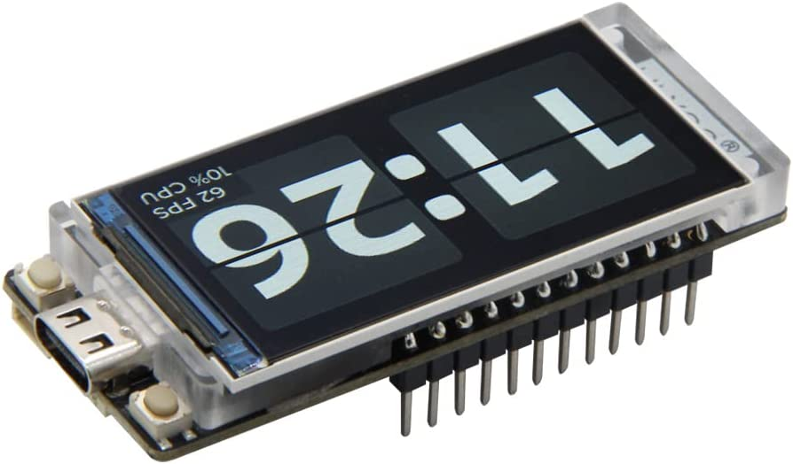

# Codes with LILYGO ESP32 Boards
- Includes all my code with Lilygo esp32 board.
  - Currently there are may boards from Lilygo.
  - But  I am using mainly two of the following boards.
    

    - 

    - 

- Personally I think these boards have a vibrant screen which makes it versatile and an ideal board for prototyping and debugging.
